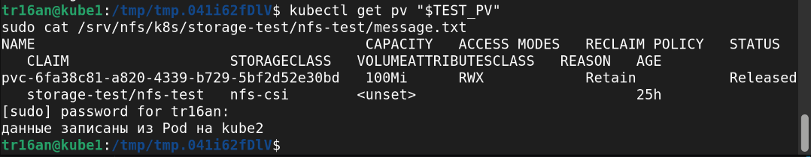

# Отчёт по домашнему заданию

## 1. Стенд

Для задания я создал три виртуальные машины в VMware Workstation.

| Узел | Роль | IP | CPU | RAM | Диск |
|---|---|---|---:|---:|---:|
| kube1 | control plane | `192.168.110.11` | 2 | 4 ГБ | 30 ГБ |
| kube2 | worker | `192.168.110.12` | 2 | 3 ГБ | 30 ГБ |
| kube3 | worker | `192.168.110.13` | 2 | 3 ГБ | 30 ГБ |

На всех машинах установлена Ubuntu Server 24.04.4 LTS.

Для виртуальных машин используется сеть VMware NAT:

- подсеть: `192.168.110.0/24`;
- шлюз: `192.168.110.2`;
- DHCP выдаёт адреса от `192.168.110.128` до `192.168.110.254`;
- адреса `.11`, `.12` и `.13` заданы вручную и не входят в DHCP-диапазон.

У всех машин разные hostname, MAC-адреса, machine-id и product UUID.

<!-- Здесь будет скриншот проверки адресов и идентификаторов узлов. -->

## 2. Подготовка Ubuntu

### Отключение swap

Swap позволяет Linux временно хранить часть данных из оперативной памяти
на диске. По умолчанию kubelet не запускается, если swap включён.

На всех трёх машинах я отключил swap:

```bash
sudo swapoff -a
```

Также я закомментировал строку `/swap.img` в `/etc/fstab`, чтобы swap не
включился снова после перезагрузки.

Проверка после перезагрузки показала `Swap: 0B` на всех узлах.

<!-- Здесь будет скриншот проверки swap. -->

### Модули ядра и сетевые настройки

Для работы контейнеров загрузил два модуля:

```text
overlay
br_netfilter
```

`overlay` нужен для файловой системы контейнеров. `br_netfilter` нужен,
чтобы сетевые правила Linux видели трафик контейнеров.

Также включил следующие параметры:

```text
net.bridge.bridge-nf-call-iptables = 1
net.bridge.bridge-nf-call-ip6tables = 1
net.ipv4.ip_forward = 1
```

`ip_forward` разрешает Linux пересылать пакеты между сетевыми
интерфейсами.

<!-- Здесь будет скриншот проверки модулей и sysctl. -->

### Имена узлов

На всех машинах добавил в `/etc/hosts`:

```text
192.168.110.11 kube1
192.168.110.12 kube2
192.168.110.13 kube3
```

После этого все три узла смогли обращаться друг к другу как по IP, так и
по именам.

<!-- Здесь будет скриншот ping между узлами. -->

## 3. Установка containerd

Containerd запускает контейнеры на узлах. Kubelet будет обращаться к
нему через CRI.

На всех трёх узлах я установил containerd из репозитория Ubuntu:

```text
containerd 2.2.1
runc 1.3.4
```

В файле `/etc/containerd/config.toml` включил:

```toml
SystemdCgroup = true
```

Это нужно, чтобы containerd и kubelet одинаково управляли ресурсами
контейнеров через systemd.

После настройки проверил службу и плагины CRI. Containerd работает и
автоматически запускается после перезагрузки, все CRI-плагины имеют
статус `ok`.

<!-- Здесь будет скриншот проверки containerd и CRI. -->

## 4. Запуск Kubernetes

На всех трёх узлах установил:

```text
kubeadm 1.33.13
kubelet 1.33.13
kubectl 1.33.13
containerd 2.2.1
Calico 3.31.6
```

Control plane запустил на `kube1` с помощью kubeadm. Для Pod использовал
сеть `10.244.0.0/16`, для Service — `10.96.0.0/12`.

После установки Calico подключил к кластеру `kube2` и `kube3`. Все три
узла перешли в состояние `Ready`.

<!-- Здесь будет скриншот kubectl get nodes -o wide. -->

### Проверка сети

Для проверки создал два временных Pod:

- `test-kube2` на узле `kube2`;
- `test-kube3` на узле `kube3`.

Ping между Pod прошёл в обе стороны без потерь. Через CoreDNS имя
`kubernetes.default.svc.cluster.local` разрешилось в адрес `10.96.0.1`.

После проверки временный namespace удалил.

<!-- Здесь будет скриншот Pod, ping и nslookup. -->

## 5. Хранилище NFS

На `kube1` установил NFS-сервер и открыл для узлов кластера каталог
`/srv/nfs/k8s`. На всех трёх узлах установил `nfs-common` версии
`2.6.4`.

Для подключения NFS к Kubernetes установил:

```text
Helm 4.2.2
NFS CSI Driver 4.13.4
```

Драйвер запущен на всех трёх узлах. Для выдачи томов создал StorageClass
`nfs-csi` с политикой `Retain`.

Для проверки создал временный PVC размером `100Mi`. Первый Pod на
`kube2` записал файл в том. После его удаления новый Pod на `kube3`
прочитал тот же файл.

После удаления тестового namespace PV перешёл в состояние `Released`,
а файл остался на NFS-сервере. Это подтвердило работу политики
`Retain`. После проверки тестовый PV и его каталог удалил.



## 6. PostgreSQL

PostgreSQL 15.18 запустил через StatefulSet. Настройки базы вынес в
ConfigMap, а пароль создал как Secret прямо в кластере и не добавлял в
Git. Для базы создал Service `postgres` и PVC размером `2Gi`.

StatefulSet, Pod и PVC запустились нормально: Pod имеет статус
`Running`, а PVC — `Bound`.


Для проверки записал строку в базу и удалил Pod. StatefulSet создал Pod
заново с другим UID, а строка осталась в базе. Значит PostgreSQL хранит
данные на постоянном томе, а не внутри Pod.


## 7. Backend v1

Собрал и опубликовал в Docker Hub образы backend с тегами `v1` и
`v2`. У образов разные digest.


Backend `v1` запустил через Deployment в трёх экземплярах. Настройки
подключаются из ConfigMap и Secret, а Service распределяет запросы между
Pod. Также настроил probes, ограничения ресурсов и запуск не от root.

При проверке запросы попали в три разных Pod, а общий счётчик в
PostgreSQL увеличился с 1 до 6.


### Самовосстановление

Удалил один backend Pod вручную. Deployment автоматически создал новый
Pod и восстановил количество готовых реплик до `3/3`.


